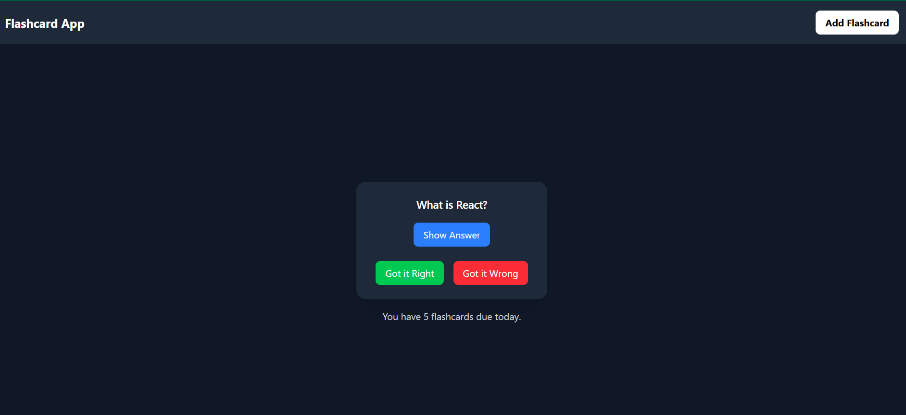

# 📚 Flashcard Learning App

A Flashcard Learning App built with the MERN stack (MongoDB, Express.js, React, Node.js) that incorporates the Leitner System for spaced repetition. This app helps users create, review, and progress through flashcards efficiently.

## Flashcard App Screenshot




## 🌟 Features

- **Create Flashcards:** Add new flashcards with questions and answers.
- **Review Flashcards:** Review flashcards using the Leitner System for spaced repetition.
- **Progress Tracking:** Move flashcards to higher boxes when answered correctly or reset to Box 1 if answered incorrectly.
- **Simple UI:** Clean and minimalistic user interface for distraction-free learning.
- **Responsive Design:** Works seamlessly on desktop and mobile devices.

## 🛠️ Technologies Used

### Frontend:
- React
- Vite
- Tailwind CSS
- Axios

### Backend:
- Node.js
- Express.js
- MongoDB
- Mongoose

### Spaced Repetition:
- Leitner System

## 🚀 Getting Started

### Prerequisites

- Node.js (v16 or higher)
- MongoDB (local or cloud instance)
- Git

### Installation

#### Clone the repository:
```bash
git clone https://github.com/your-username/flashcard-learning-app.git
cd flashcard-learning-app
```

#### Set up the backend:
```bash
cd backend
npm install
```

#### Set up the frontend:
```bash
cd ../frontend
npm install
```

#### Configure environment variables:

Create a `.env` file in the backend folder:
```env
MONGO_URI=your_mongodb_connection_string
PORT=5000
```

#### Start the backend server:
```bash
cd ../backend
npm start
```

#### Start the frontend server:
```bash
cd ../frontend
npm run dev
```

#### Open the app:
Visit [http://localhost:5173](http://localhost:5173) in your browser.

## 🎯 How It Works

### Leitner System
- Flashcards start in Box 1.
- If a flashcard is answered correctly, it moves to the next box.
- If answered incorrectly, it goes back to Box 1.
- Higher boxes have longer review intervals (e.g., Box 2: 2 days, Box 3: 4 days).

### Frontend Features
- **Add Flashcards:** Use the form to add new flashcards.
- **Review Flashcards:** Review flashcards due for the day.
- **Track Progress:** See how many flashcards are due today.

## 📂 Project Structure
```
flashcard-learning-app/
├── backend/
│   ├── models/              # MongoDB models
│   ├── routes/              # API routes
│   ├── server.js            # Backend entry point
│   └── .env                 # Environment variables
├── frontend/
│   ├── public/              # Static assets
│   ├── src/
│   │   ├── components/      # React components
│   │   ├── pages/           # React pages
│   │   ├── App.jsx          # Main app component
│   │   └── main.jsx         # Frontend entry point
│   └── package.json         # Frontend dependencies
└── README.md                # Project documentation
```

## 📝 Usage

### Add a Flashcard:
1. Fill in the question and answer fields in the form.
2. Click **Add Flashcard**.

### Review Flashcards:
1. Flashcards due for review will appear on the home page.
2. Click **Show Answer** to reveal the answer.
3. Click **Got it right** to move the flashcard to the next box.
4. Click **Got it wrong** to reset the flashcard to Box 1.

## 🚧 Future Enhancements
- **User Authentication:** Allow users to create accounts and save their progress.
- **Dark Mode:** Add a toggle for dark mode.
- **Animations:** Use Framer Motion for smooth transitions.
- **Deployment:** Deploy the app on Vercel (frontend) and Render (backend).

## 🤝 Contributing

Contributions are welcome! Follow these steps:

1. Fork the repository.
2. Create a new branch:
   ```bash
   git checkout -b feature/your-feature-name
   ```
3. Commit your changes:
   ```bash
   git commit -m "Add your feature"
   ```
4. Push to the branch:
   ```bash
   git push origin feature/your-feature-name
   ```
5. Open a pull request.

## 📄 License

This project is licensed under the MIT License. See the [LICENSE](LICENSE) file for details.

## 🙏 Acknowledgments
- Inspired by the Leitner System for spaced repetition.
- Built with the MERN stack for a full-stack development experience.

## 📧 Contact
For questions or feedback, feel free to reach out:

**Email ID** b.tarunaksha@gmail.com

**GitHub:** [tarunaksha](https://github.com/tarunaksha)
